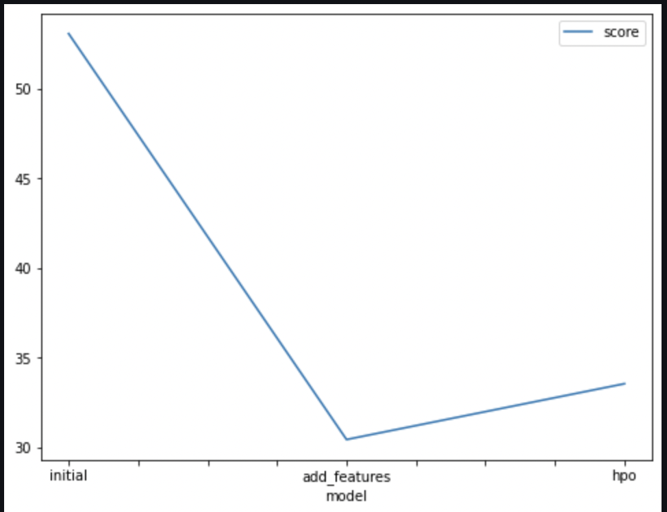
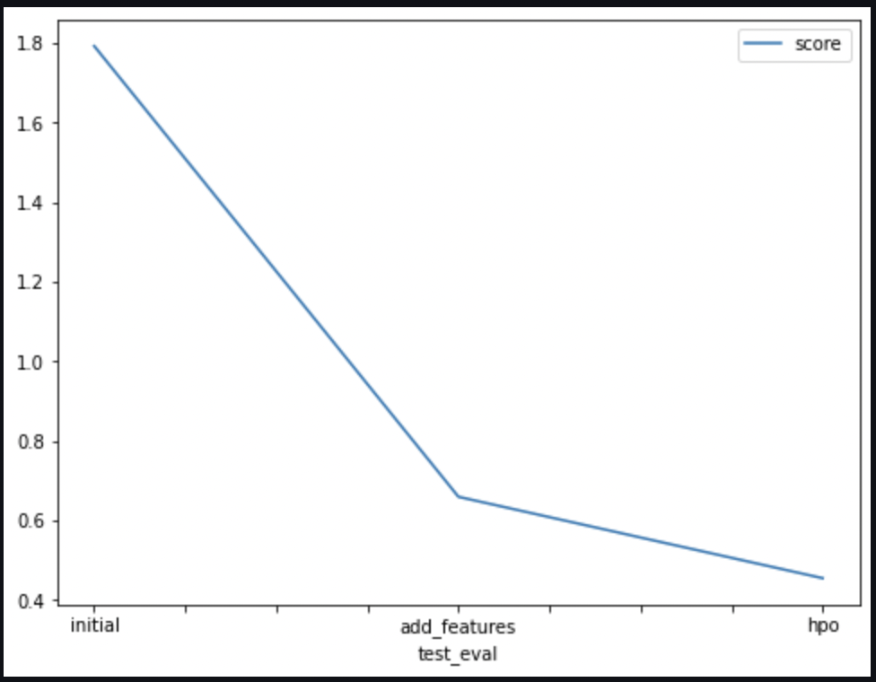

# Report: Predict Bike Sharing Demand with AutoGluon Solution
#### NAME HERE

## Initial Training
### What did you realize when you tried to submit your predictions? What changes were needed to the output of the predictor to submit your results?
Before submitting predictions I had to round negative prediction values to 0.

### What was the top ranked model that performed?
the last model submitted with hyperparameter tuning is the top ranked model with a score of 0.45495.

## Exploratory data analysis and feature creation
### What did the exploratory analysis find and how did you add additional features?
I optained hour, day, month and year features from the feature datetime and transformed the features season and weather that have initial integer values into category data type.

### How much better did your model preform after adding additional features and why do you think that is?
After  adding additional features the model score improved from 1.79192 to 0.65941. It shows that the added features are relevant and helped the model have more accurate predictions.

## Hyper parameter tuning
### How much better did your model preform after trying different hyper parameters?
after trying different hyper parameters the model performed slightly better.

### If you were given more time with this dataset, where do you think you would spend more time?
I would spend more time tuning hyperparameters.

### Create a table with the models you ran, the hyperparameters modified, and the kaggle score.
|model|hpo1|hpo2|hpo3|score|
|--|--|--|--|--|
|initial|label : count |eval metric : root_mean_squared_error|learner_kwargs={ignored_columns : [ casual ,  registered]|1.79192|
|add_features|initial|initial|initial|0.65941|
|hpo|GBM|RF|XT|0.45495|

### Create a line plot showing the top model score for the three (or more) training runs during the project.

TODO: Replace the image below with your own.

### Create a line plot showing the top kaggle score for the three (or more) prediction submissions during the project.

TODO: Replace the image below with your own.

## Summary
In this project, I started with a model that was initially submitted to Bike Sharing Demand Kaggle competition. After analyzing the performance of the model, I identified areas for improvement and decided to enhance it by adding additional features. Once the new features were incorporated, hyperparameter tuning were performed to further optimize the model's performance.

By incorporating the additional features and performing hyperparameter tuning,  the model's performance improved compared to the initial submission.
